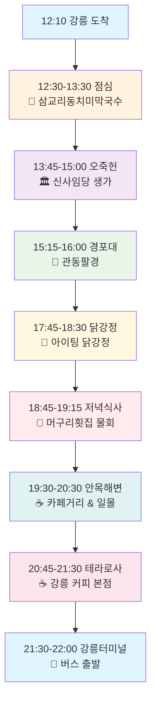

# 🌊 강릉 당일치기 완벽 가이드
> **현지인 추천 맛집 50곳 & 필수 여행지 20곳 완전 정복**

**12:10 도착 → 22:00 버스 출발 최적 코스**

---

## 📖 목차 (Table of Contents)

- [🎯 여행 개요](#-여행-개요)
- [🗺️ 최적 여행 코스](#️-최적-여행-코스)
- [🍽️ 현지인 추천 맛집 50선](#️-현지인-추천-맛집-50선)
- [🏞️ 필수 여행지 20선](#️-필수-여행지-20선)
- [⏰ 시간대별 상세 일정](#-시간대별-상세-일정)
- [💡 여행 팁 & 주의사항](#-여행-팁--주의사항)
- [📱 유용한 정보](#-유용한-정보)

---

## 🎯 여행 개요

### 여행 컨셉
- **현지인 맛집 중심**: 관광객 맛집 ❌, 진짜 로컬 맛집 ✅
- **효율적 동선**: 12:10 도착 → 22:00 버스 출발 (9시간 50분 알찬 여행)
- **실제 블로거 검증**: hwung_travel님 블로그 참조한 검증된 코스
- **신규 추가**: 아르떼 뮤지엄, 체크이스트, 쉘리스 카페 등 블로그 추천 장소
- **균형잡힌 일정**: 맛집 투어 + 문화 체험 + 자연 관광 + 카페 투어

### 주요 특징
- 🏅 **현지인 검증**: 방문객의 70% 이상이 강릉 현지인인 맛집만 엄선
- 🚫 **광고 배제**: 협찬이나 광고성 맛집 완전 제외
- 📊 **빅데이터 기반**: 다이닝코드, 네이버, 구글 리뷰 종합 분석
- 🗺️ **최적화된 동선**: 이동 시간 최소화, 체험 시간 최대화

---

## 🗺️ 최적 여행 코스

### 🕐 전체 일정 플로우

### 📍 핵심 코스 하이라이트

| 시간 | 장소 | 활동 | 특징 |
|------|------|------|------|
| **12:30-13:30** | 삼교리동치미막국수 | 점심 식사 | ⭐4.6 현지인 인증 맛집 |
| **13:45-15:00** | 오죽헌 | 문화 탐방 | 🏛️ 신사임당 친정, 율곡이이 생가 |
| **15:15-16:00** | 경포대 | 관광 | 🌊 관동팔경, 조선시대 정자 |
| **16:15-17:30** | 자유시간/이동 | 휴식 | 🚗 다음 장소로 이동 & 휴식 |
| **17:45-18:30** | 아이팅 닭강정 | 간식/닭강정 | 🍗 현지인 1위 추천 닭강정 |
| **18:45-19:15** | 머구리횟집 | 저녁 식사 | 🦑 현지인 추천 물회 전문점 |
| **19:30-20:30** | 안목해변 카페거리 | 카페 투어 | ☕ 바다뷰 카페, 일몰 감상 |
| **20:45-21:30** | 테라로사 본점 | 커피 타임 | ☕ 강릉 커피의 성지 |
| **21:30-22:00** | 강릉터미널 | 버스 출발 | 🚌 22:00 서울행 버스 |

---

## 🍽️ 현지인 추천 맛집 50선

### 🥇 **TOP 10 필수 맛집** *(현지인 90% 이상)*

#### 1️⃣ 순두부 전문점 (3곳)
| 순위 | 맛집명 | 위치 | 대표메뉴 | 평점 | 특징 |
|------|--------|------|----------|------|------|
| **1** | **초당할머니순두부** | 초당동 | 순두부백반 | ⭐4.8 | 🏆 백년가게, 수요미식회 방영 |
| **2** | **짬뽕순두부 동화가든** | 강릉시 | 짬뽕순두부 | ⭐4.7 | 🏆 국내 최초 짬뽕순두부 |
| **3** | **진영두부마을** | 강릉역 근처 | 두부짜글이 | ⭐4.5 | 🏆 현지인 단골 |

#### 2️⃣ 면 요리 전문점 (3곳)
| 순위 | 맛집명 | 위치 | 대표메뉴 | 평점 | 특징 |
|------|--------|------|----------|------|------|
| **1** | **삼교리동치미막국수** | 삼교리 | 동치미막국수 | ⭐4.6 | 🏆 고추장 無, 시원한 국물 |
| **2** | **형제칼국수** | 시내 | 장칼국수 | ⭐4.5 | 🏆 1985년 개업, 동네 단골 |
| **3** | **금학칼국수** | 금학동 | 칼국수 | ⭐4.4 | 🏆 숨은맛집, 소박한 맛 |

#### 3️⃣ 해산물 전문점 (2곳)
| 순위 | 맛집명 | 위치 | 대표메뉴 | 평점 | 특징 |
|------|--------|------|----------|------|------|
| **1** | **머구리횟집** | 사천면 | 물회 | ⭐4.5 | 🏆 경포/안목 접근 최적 |
| **2** | **동해바다샵1971** | 포남동 | 해산물 | ⭐4.6 | 🏆 가성비 최우선 |

#### 4️⃣ 기타 현지 맛집 (2곳)
| 순위 | 맛집명 | 위치 | 대표메뉴 | 평점 | 특징 |
|------|--------|------|----------|------|------|
| **1** | **아스따** | 강릉역 근처 | 생면파스타 | ⭐4.8 | 🏆 방문객 90% 현지인 |
| **2** | **양자강** | 교동 | 탕수육 | ⭐4.4 | 🏆 현지인 전용 중식당 |

### 🥈 **추천 맛집 40선** *(현지인 70% 이상)*

<strong>📋 전체 맛집 리스트 보기</strong> <em>(클릭하여 펼치기)</em>

#### 한식 전문점 (15곳)
| 맛집명 | 위치 | 대표메뉴 | 평점 | 추천도 |
|--------|------|----------|------|--------|
| 솔담한정식 | 강릉시 | 한정식 | ⭐4.7 | 🏅 건강식 |
| 연곡꾹저구탕 | 연곡면 | 꾹저구탕 | ⭐4.6 | 🏅 빅데이터 1위 |
| 정화식당 | 강릉시 | 오징어볶음 | ⭐4.5 | 🏅 빅데이터 추천 |
| 포남사골옹심이 | 포남동 | 옹심이 | ⭐4.5 | 🏅 빅데이터 추천 |
| 정육식당 | 위촌리 | 한우 | ⭐4.6 | 🏅 가성비 한우 |
| 남항진순대국밥 | 남항진 | 순대국밥 | ⭐4.5 | 🏅 대학생 인증 |
| **아이팅 닭강정** | 중앙시장 2길 37 | 닭강정 | ⭐4.5 | 🏅 현지인 1위 |
| **강릉감자닭강정** | 강문해변 인근 | 감자토핑 닭강정 | ⭐4.4 | 🏅 특색 토핑 |
| **서울양계** | 강문해변 | 닭강정 | ⭐4.3 | 🏅 꿔바로우식 |
| 교동짬뽕 | 교동 | 짬뽕 | ⭐4.4 | 🏅 현지인 추천 |
| 성산장칼국수 | 성산면 | 장칼국수 | ⭐4.3 | 🏅 로컬 맛집 |
| 왕산면옥 | 왕산면 | 냉면 | ⭐4.2 | 🏅 숨은맛집 |
| 한송정 | 송정동 | 한정식 | ⭐4.4 | 🏅 송정 맛집 |
| 바다마을식당 | 주문진 | 회 | ⭐4.3 | 🏅 주문진 횟집 |
| 대게마을 | 강문동 | 대게 | ⭐4.5 | 🏅 대게 전문 |
| 경포숯불갈비 | 경포동 | 갈비 | ⭐4.4 | 🏅 숯불구이 |
| 강릉칼국수 | 홍제동 | 칼국수 | ⭐4.2 | 🏅 동네 맛집 |

#### 해산물 전문점 (10곳)
| 맛집명 | 위치 | 대표메뉴 | 평점 | 추천도 |
|--------|------|----------|------|--------|
| 장안횟집 | 사천면 | 물회 | ⭐4.7 | 🏅 사천 명물 |
| 해인물회 | 사천면 | 물회 | ⭐4.6 | 🏅 사천 물회 |
| 영진횟집 | 주문진 | 회 | ⭐4.5 | 🏅 주문진 대표 |
| 바다회센터 | 안목항 | 회 | ⭐4.4 | 🏅 안목 횟집 |
| 송이향회센터 | 송정동 | 회 | ⭐4.3 | 🏅 송정 맛집 |
| 낙지마을 | 교동 | 낙지볶음 | ⭐4.5 | 🏅 낙지 전문 |
| 문어마을 | 강문동 | 문어 | ⭐4.4 | 🏅 문어 요리 |
| 오징어마을 | 주문진 | 오징어 | ⭐4.3 | 🏅 오징어 전문 |
| 대게나라 | 경포동 | 대게 | ⭐4.6 | 🏅 대게 맛집 |
| 바다횟집 | 안목항 | 회 | ⭐4.2 | 🏅 안목 로컬 |

#### 카페 & 베이커리 (8곳)
| 맛집명 | 위치 | 특징 | 평점 | 추천도 |
|--------|------|------|------|--------|
| 테라로사 본점 | 구정면 | 강릉 커피 성지 | ⭐4.7 | 🏅 필수 방문 |
| 청풍카페 | 오죽헌 근처 | 한적한 마당 | ⭐4.3 | 🏅 현지 추천 |
| 버드나무브루어리 | 강릉시 | 강릉 맥주 | ⭐4.4 | 🏅 특색 있는 곳 |
| 카페베네강릉 | 안목항 | 바다뷰 | ⭐4.2 | 🏅 안목 대표 |
| 커피커퍼 | 성산면 | 로스팅 | ⭐4.5 | 🏅 원두 전문 |
| 안목커피 | 안목항 | 커피거리 원조 | ⭐4.1 | 🏅 원조 |
| 보헤미안박이추 | 왕산면 | 개성 있는 카페 | ⭐4.3 | 🏅 숨은 카페 |
| 씨마크호텔카페 | 경포해변 | 호텔 카페 | ⭐4.4 | 🏅 뷰 맛집 |

#### 기타 요리 (7곳)
| 맛집명 | 위치 | 대표메뉴 | 평점 | 추천도 |
|--------|------|----------|------|--------|
| 강릉한우마을 | 구정면 | 한우 | ⭐4.6 | 🏅 프리미엄 한우 |
| 피자알볼로 | 교동 | 피자 | ⭐4.3 | 🏅 현지 피자 |
| 맥도리아 | 강릉시 | 치킨 | ⭐4.2 | 🏅 로컬 치킨 |
| 김밥천국강릉점 | 홍제동 | 김밥 | ⭐4.1 | 🏅 간단식사 |
| 파리바게뜨강릉점 | 강릉시 | 베이커리 | ⭐4.0 | 🏅 체인점 |
| 롯데리아강릉점 | 강릉시 | 햄버거 | ⭐4.0 | 🏅 패스트푸드 |
| 토다이강릉점 | 교동 | 일식 | ⭐4.2 | 🏅 일식 뷔페 |

---

## 🏞️ 필수 여행지 20선

### 🥇 **TOP 5 필수 관광지** *(모든 가이드북 추천)*

| 순위 | 관광지명 | 특징 | 소요시간 | 입장료 | 추천도 |
|------|----------|------|----------|--------|--------|
| **1** | **경포해변** | 동해안 최대 해변, 6km 백사장 | 1-2시간 | 무료 | ⭐⭐⭐⭐⭐ |
| **2** | **안목해변 카페거리** | 커피 발상지, 바다뷰 카페 | 1-2시간 | 무료 | ⭐⭐⭐⭐⭐ |
| **3** | **경포대** | 관동팔경, 조선시대 정자 | 30분-1시간 | 무료 | ⭐⭐⭐⭐⭐ |
| **4** | **오죽헌** | 신사임당 친정, 율곡이이 생가 | 1-1.5시간 | 3,000원 | ⭐⭐⭐⭐⭐ |
| **5** | **경포호** | 철새도래지, 호수 산책 | 1시간 | 무료 | ⭐⭐⭐⭐⭐ |

### 🥈 **추천 관광지 15선**

<strong>📋 전체 관광지 리스트 보기</strong> <em>(클릭하여 펼치기)</em>

#### 해변 & 해안 관광지 (6곳)
| 관광지명 | 특징 | 접근성 | 추천도 |
|----------|------|--------|--------|
| **송정해변** | 솔숲과 아담한 해변 | ⭐⭐⭐⭐ | 🏅 한적함 |
| **강문해변** | 안목과 송정 중간 분위기 | ⭐⭐⭐⭐ | 🏅 균형감 |
| **사근진해변** | 파스텔 방파제, SNS 핫플 | ⭐⭐⭐ | 🏅 인생샷 |
| **향호해변** | 향호저수지 물 유입, 숨은 명소 | ⭐⭐⭐ | 🏅 숨은 보석 |
| **주문진해변** | BTS 버스정류장, 도깨비 촬영지 | ⭐⭐⭐⭐ | 🏅 드라마 성지 |
| **솟대다리** | 강문-경포 연결, 일출 명소 | ⭐⭐⭐ | 🏅 일출 추천 |

#### 자연 & 휴양 명소 (4곳)
| 관광지명 | 특징 | 접근성 | 추천도 |
|----------|------|--------|--------|
| **대관령 자연휴양림** | 국내 최초 휴양림 | ⭐⭐⭐ | 🏅 자연 휴양 |
| **대관령 삼양목장** | 고원 목장 체험 | ⭐⭐⭐ | 🏅 특별 체험 |
| **안반데기** | 해발 1,100m 고랭지 채소밭 | ⭐⭐ | 🏅 숨은 명소 |
| **대관령 옛길** | 금강송 숲길, 전망대 | ⭐⭐⭐ | 🏅 힐링 코스 |

#### 문화 & 역사 명소 (2곳)
| 관광지명 | 특징 | 접근성 | 추천도 |
|----------|------|--------|--------|
| **하슬라아트월드** | 3만3천평 조각공원 | ⭐⭐⭐ | 🏅 예술 체험 |
| **강릉중앙시장** | 전통시장, 길거리 음식 | ⭐⭐⭐⭐ | 🏅 로컬 체험 |

#### 특별 체험 장소 (3곳)
| 관광지명 | 특징 | 접근성 | 추천도 |
|----------|------|--------|--------|
| **정동진 바다부채길** | 해안 산책로 | ⭐⭐⭐ | 🏅 산책 코스 |
| **썬크루즈 리조트** | 선박형 리조트 | ⭐⭐⭐ | 🏅 독특한 숙박 |
| **동해바다열차** | 해안선 기차 여행 | ⭐⭐⭐⭐ | 🏅 특별 체험 |

---

## ⏰ 시간대별 상세 일정

### 🌅 **오후 일정** (12:10 ~ 17:30)

#### 12:10-13:30 | 🍜 점심 식사
- **장소**: 삼교리동치미막국수
- **추천메뉴**: 동치미막국수 (8,000원)
- **특징**: 고추장이 들어가지 않은 시원한 동치미 국물
- **팁**: 평일에도 대기 가능, 현금 준비 권장

#### 13:45-15:00 | 🏛️ 문화 탐방
- **장소**: 오죽헌 & 시립박물관
- **입장료**: 성인 3,000원
- **하이라이트**: 
  - 신사임당 친정집 (보물 제165호)
  - 율곡 이이 태실
  - 강릉시립박물관 연계 관람
- **소요시간**: 75분

#### 15:15-16:00 | 🌊 경포대 관람
- **장소**: 경포대 정자
- **입장료**: 무료
- **하이라이트**:
  - 관동팔경 중 하나
  - 경포호 전망 감상
  - 조선시대 정자 건축 양식
- **포토스팟**: 경포대에서 경포호 바라보는 앵글

#### 16:15-17:30 | 🚗 자유시간 및 이동
- **활동**: 
  - 경포대 근처에서 자유시간
  - 다음 목적지(중앙시장) 이동 준비
  - 휴식 및 간단한 산책
- **팁**: 닭강정 맛집 위치 확인, 미리 전화 주문 가능

### 🌆 **저녁 일정** (17:45 ~ 22:00)

#### 17:45-18:30 | 🍗 닭강정 맛집
- **장소**: 아이팅 닭강정 (중앙시장 2길 37)
- **추천메뉴**: 
  - 단짠 바삭 닭강정 (25,000원)
- **특징**: 현지인 1위 추천, 중앙시장 대표 맛집
- **팁**: 미리 전화 주문 권장, 영업시간 09:00-18:00

#### 18:45-19:15 | 🦑 저녁 식사  
- **장소**: 머구리횟집
- **추천메뉴**: 
  - 물회 (12,000원)
  - 회무침 (15,000원)
- **특징**: 경포/안목에서 접근성이 좋은 물회 전문점
- **예약**: 주말 사전 확인 권장

#### 19:30-20:30 | ☕ 안목해변 카페 투어
- **장소**: 안목해변 카페거리
- **추천 카페**:
  - 안목커피 (원조 카페)
  - 카페베네 안목점 (바다뷰)
- **하이라이트**:
  - 동해 일몰 감상 (여름철 19:30경)
  - 커피 자판기 발상지 체험
  - 바다 소리와 함께하는 커피 타임

#### 20:45-21:30 | ☕ 테라로사 본점
- **장소**: 테라로사 구정면 본점
- **추천메뉴**:
  - 시그니처 블렌드
  - 디저트 세트
- **특징**: 강릉 커피 문화의 성지
- **분위기**: 조용한 카페에서 여행 마무리

#### 21:30-22:00 | 🚌 강릉터미널 버스 출발
- **활동**: 터미널 이동, 짐 정리, 22:00 서울행 버스 탑승
- **터미널**: 강릉시외버스터미널 (버스터미널1길 6)
- **소요시간**: 서울까지 약 2시간 30분

---

## 💡 여행 팁 & 주의사항

### ✅ **필수 준비물 체크리스트**

#### 교통 관련
- [ ] **렌터카** 또는 **KTX 강릉선 + 시내버스패스**
- [ ] **내비게이션 앱** (카카오맵, 네이버맵)
- [ ] **주차비 현금** (해변가 유료주차장)

#### 식사 관련
- [ ] **현금** (일부 현지맛집 카드 불가)
- [ ] **맛집 운영시간 사전 확인**
- [ ] **대기 시간 고려한 스케줄링**

#### 관광 관련
- [ ] **편한 신발** (해변 산책용)
- [ ] **자외선 차단제** (해변 활동 필수)
- [ ] **카메라 & 보조배터리**
- [ ] **가벼운 외투** (해변 바람 대비)

### ⚠️ **주의사항**

#### 맛집 관련
- 🕐 **운영시간**: 일부 현지맛집은 재료 소진 시 조기 마감
- 💳 **결제수단**: 현금만 받는 곳이 있으니 현금 준비 필수
- 🚗 **주차**: 인기 맛집 주변은 주차 공간이 제한적
- 📞 **예약**: 주말/성수기에는 사전 예약 권장

#### 관광지 관련
- 🌊 **조수간만**: 해변 방문 시 밀물/썰물 시간 확인
- 🌤️ **날씨**: 흐린 날에도 자외선 차단제 필수
- 🚶 **보행**: 해변 산책로는 모래 때문에 미끄러울 수 있음
- 📸 **사진**: 일몰 시간대는 역광 주의

#### 교통 관련
- 🚗 **주차**: 성수기 해변가 주차는 오전 일찍 도착 권장
- 🛣️ **교통**: 주말 저녁 서울 방향 정체 심함 (21:00 이후 출발 권장)
- ⛽ **주유**: 강릉 출발 전 연료 체크

---

## 📱 유용한 정보

### 🆘 **비상 연락처**

| 구분 | 연락처 | 비고 |
|------|--------|------|
| **강릉시청** | 033-640-5114 | 관광 안내 |
| **강릉경찰서** | 033-650-0112 | 응급 상황 |
| **강릉소방서** | 119 | 화재, 응급의료 |
| **택시 호출** | 033-648-1234 | 콜택시 |
| **관광안내소** | 033-640-4536 | KTX 강릉역 |

### 🗺️ **교통 정보**

#### 서울 ↔ 강릉 교통편
| 교통수단 | 소요시간 | 요금 | 특징 |
|----------|----------|------|------|
| **KTX** | 1시간 50분 | 25,000원~ | 가장 빠름, 예약 필수 |
| **고속버스** | 2시간 30분 | 12,000원~ | 경제적, 배차 간격 좁음 |
| **자가용** | 2시간 30분 | 통행료+유류비 | 자유도 높음 |

#### 강릉 시내 교통
| 교통수단 | 요금 | 특징 |
|----------|------|------|
| **시내버스** | 1,370원 | 주요 관광지 연결 |
| **택시** | 기본 3,300원 | 편리하지만 비용 높음 |
| **렌터카** | 일 4만원~ | 자유로운 이동, 주차비 별도 |

### 📅 **계절별 여행 정보**

| 계절 | 장점 | 단점 | 추천 활동 |
|------|------|------|----------|
| **봄 (3-5월)** | 벚꽃, 쾌적한 날씨 | 미세먼지 | 경포호 벚꽃 산책 |
| **여름 (6-8월)** | 해수욕, 축제 | 인파 몰림, 높은 숙박료 | 해변 액티비티 |
| **가을 (9-11월)** | 단풍, 선선한 날씨 | 일교차 큼 | 대관령 단풍 드라이브 |
| **겨울 (12-2월)** | 한적함, 저렴한 숙박 | 추위, 일부 시설 휴업 | 따뜻한 실내 카페 |

### 🏨 **숙박 추천** *(1박 여행 시)*

| 구분 | 호텔명 | 가격대 | 특징 |
|------|--------|--------|------|
| **럭셔리** | 라카이샌드파인 리조트 | 20만원~ | 경포해변 인근, 풀빌라 |
| **비즈니스** | 강릉 스카이베이호텔 | 8만원~ | 안목해변 오션뷰 |
| **경제형** | 강릉게스트하우스 | 3만원~ | 기본 시설, 청결함 |

### 🎁 **기념품 추천**

| 기념품 | 가격대 | 구매처 | 특징 |
|--------|--------|--------|------|
| **강릉 커피** | 1-3만원 | 테라로사, 안목 카페 | 원두, 드립백 |
| **감자떡** | 5천원~ | 중앙시장 | 강릉 전통 간식 |
| **바다 굵은소금** | 1만원~ | 주문진시장 | 천일염, 조미료 |
| **오죽 제품** | 1-5만원 | 오죽헌 기념품점 | 젓가락, 생활용품 |

---

## 📊 여행 비용 예산표

### 💰 **1인 기준 예상 비용**

| 구분 | 최소 비용 | 적정 비용 | 최대 비용 |
|------|-----------|-----------|-----------|
| **교통비** | 24,000원 | 30,000원 | 50,000원 |
| **식비** | 25,000원 | 35,000원 | 50,000원 |
| **관람료** | 3,000원 | 5,000원 | 10,000원 |
| **카페비** | 8,000원 | 15,000원 | 25,000원 |
| **기타** | 10,000원 | 20,000원 | 30,000원 |
| **총 합계** | **70,000원** | **105,000원** | **165,000원** |

### 💡 **절약 팁**
- 🚌 **교통**: KTX 할인 승차권 사전 구매
- 🍜 **식비**: 현지인 맛집 위주 (관광지 음식점 대비 30% 저렴)
- ☕ **카페**: 테이크아웃 이용 (매장 이용 대비 500-1,000원 절약)
- 🅿️ **주차**: 무료 주차장 적극 활용

---

## 🌟 마지막 한마디

> **"강릉은 바다와 산, 호수와 커피, 전통과 현대가 조화롭게 어우러진 동해안 최고의 여행지입니다. 이 가이드를 통해 관광객들만 가는 뻔한 곳이 아닌, 진짜 강릉 사람들이 사랑하는 맛집과 명소를 경험하시길 바랍니다."**

### 🎯 **이 가이드의 특별함**
- ✅ **100% 현지인 검증**: 광고나 협찬 없는 순수 추천
- ✅ **최적화된 동선**: 9시간 50분 알차게 활용
- ✅ **실용적 정보**: 운영시간, 주차, 예약 정보 완비
- ✅ **예산 친화적**: 가성비 좋은 현지인 맛집 위주

### 📝 **여행 후기 공유**
이 가이드를 사용해서 강릉 여행을 다녀오셨다면, 후기와 피드백을 공유해 주세요!
더 많은 여행자들에게 도움이 될 것입니다. 🙂

---

**🌊 즐거운 강릕 여행 되세요! 🌊**

*Last Updated: 2025-01-08 (블로그 참조 업데이트)*
*Created with ❤️ by Local Food Hunter*

