# 🎣 6명 전어 낚시 1박 2일 여행 완벽 가이드

> **목적지**: 충남 서산시 삼길포항  
> **인원**: 남성 6명  
> **기간**: 1박 2일  
> **시즌**: 10월 말~12월 중순 (전어 피크 시즌)

---

## 🌊 여행 개요

### 🎯 여행 목표
- 전어 낚시 체험 (초보자 포함)
- 6명 단체 우정 도모
- 합리적 비용으로 알찬 여행
- 대중교통 이용 친환경 여행

### 📍 선정 이유: 삼길포항
✅ **전어 낚시 명소** - 서해안 최고의 전어 포인트  
✅ **완벽한 접근성** - 대중교통으로 접근 가능  
✅ **편의시설 완비** - 숙박, 식당, 낚시점 현지 완비  
✅ **합리적 비용** - 6명 분담시 경제적  
✅ **풍부한 볼거리** - 서산 9경 중 하나  

---

## 🗓️ 상세 여행 일정

### 📅 Day 1 (토요일) - 출발 & 도착

#### 🌅 06:00 - 서울 출발
- **집합 장소**: 서울남부터미널 또는 센트럴시티터미널
- **준비사항**: 
  - 멀미약 복용 (배낚시 대비)
  - 보온병에 따뜻한 음료 준비
  - 최종 짐 점검

#### 🚌 06:00~08:30 - 이동 (서울→서산)
- **교통편**: 고속버스 (센트럴시티→서산공용버스터미널)
- **소요시간**: 약 2시간 30분
- **비용**: 약 15,000~18,000원/인

#### 🚐 09:00~09:40 - 서산→삼길포 이동
- **교통편**: 910번 좌석버스 (15분 간격 운행)
- **소요시간**: 약 40분
- **비용**: 약 2,500원/인

#### 🏠 10:00 - 숙소 도착 및 체크인
**삼길포 포졸란펜션**
- **주소**: 충남 서산시 대산읍 삼길포4길 5
- **연락처**: 041-668-1124
- **객실**: 음악다방 또는 비틀즈룸 (6~8명 수용)
- **시설**: 바베큐장, 주방, 레트로 감성 인테리어

#### 🛒 10:30 - 낚시 장비 조달
**대박마트낚시**
- **주소**: 서산시 대산읍 삼길포1로 69 1층
- **연락처**: 041-669-2020
- **구매 품목**:
  - 낚싯대, 카드채비, 도래추 (13,200원/인)
  - 곤쟁이, 크릴, 밑밥 재료
  - 추가 필요 용품

#### 🍽️ 11:30 - 점심 식사
**집으로횟집** (추천 1순위)
- **주소**: 충남 서산시 대산읍 삼길포1로 165-1
- **메뉴**: 파장찌개 중(3인) + 소(2인) = 70,000원
- **특징**: 현지인 인증 숨은 맛집

#### 🎣 13:00~17:00 - 전어 낚시 (4시간)
**삼길포 방파제**
- **포인트**: 방파제 끝 우럭동상 주변 (최고 조황)
- **채비**: 카드채비 + 막대찌 + 곤쟁이 미끼
- **기법**: 밑밥 지속 투여, 예민한 채비 유지
- **안전**: 생명조끼 착용, 날씨 변화 주의

#### 🏨 17:30 - 펜션 복귀 및 휴식
- 잡은 고기 손질 및 정리
- 저녁 준비 및 휴식

#### 🍖 19:00 - 저녁 바베큐 파티
**펜션 바베큐장 이용**
- **메뉴**: 잡은 고기 구이 + 구입한 고기 + 야채
- **분위기**: 레트로 감성 펜션에서 추억의 바베큐
- **음료**: 현지 편의점에서 구매

#### 🌙 21:00 - 자유시간
- 펜션 내 레트로 감성 즐기기
- 내일 낚시 준비 및 계획
- 조기 취침 (새벽 낚시 대비)

### 📅 Day 2 (일요일) - 낚시 & 귀가

#### 🌄 05:00 - 기상 및 준비
- 간단한 아침 식사 (김밥, 커피)
- 낚시 장비 점검
- 헤드랜턴 착용 (아직 어둠)

#### 🎣 05:30~10:00 - 새벽 낚시 (4.5시간)
**삼길포항 일대**
- **최적 시간**: 일출 전후 (전어 활성도 최고)
- **포인트**: 방파제 + 항구 내측
- **목표**: 전어 떡전어 노리기

#### 🍽️ 10:30 - 브런치
**삼길포막횟집** (바다 전망 식당)
- **주소**: 충남 서산시 대산읍 삼길포1로 171
- **메뉴**: 막썰어회, 물회, 해물모둠
- **비용**: 약 150,000~200,000원 (6명)

#### 📸 12:00 - 기념 촬영 & 정리
- 삼길포항 주변 포토존에서 단체 사진
- 낚시 장비 정리 및 반납
- 펜션 체크아웃

#### 🚐 13:00~13:40 - 삼길포→서산 이동
- **교통편**: 910번 버스
- **준비사항**: 잡은 고기 아이스박스 포장

#### 🚌 14:00~16:30 - 서산→서울 이동
- **교통편**: 고속버스 (서산→센트럴시티)
- **차내**: 여행 사진 정리, 후기 공유

#### 🏁 17:00 - 서울 도착 및 해산
- 개별 귀가
- 다음 여행 약속!

---

## 📊 여행 일정 시각화

```mermaid
gantt
    title 🎣 6명 전어 낚시 1박 2일 여행 일정
    dateFormat  HH:mm
    axisFormat %H:%M

    section Day 1 (토요일)
    서울 출발 (센트럴시티)           :milestone, m1, 06:00, 0h
    서울→서산 이동 (고속버스)        :travel1, 06:00, 08:30
    서산→삼길포 이동 (910번 버스)     :travel2, 09:00, 09:40
    펜션 체크인                    :checkin, 10:00, 10:30
    낚시 장비 조달 (대박마트)        :shopping, 10:30, 11:30
    점심 식사 (집으로횟집)          :lunch1, 11:30, 13:00
    전어 낚시 (오후)              :fishing1, 13:00, 17:00
    펜션 휴식                     :rest1, 17:30, 19:00
    저녁 바베큐 파티              :dinner1, 19:00, 21:00
    자유시간 및 취침               :sleep, 21:00, 05:00

    section Day 2 (일요일)
    기상 및 준비                  :wakeup, 05:00, 05:30
    새벽 낚시 (최고 시간대)         :fishing2, 05:30, 10:00
    브런치 (삼길포막횟집)          :brunch, 10:30, 12:00
    기념촬영 및 정리               :photo, 12:00, 13:00
    삼길포→서산 이동              :travel3, 13:00, 13:40
    서산→서울 이동 (고속버스)       :travel4, 14:00, 16:30
    서울 도착 및 해산              :milestone, m2, 17:00, 0h
```

---

## 💰 상세 예산 계획 (6명 기준)

### 🚌 교통비
| 구간 | 교통편 | 비용(1인) | 6명 총액 |
|------|-------|----------|---------|
| 서울↔서산 | 고속버스(왕복) | 30,000원 | 180,000원 |
| 서산↔삼길포 | 910번버스(왕복) | 5,000원 | 30,000원 |
| **교통비 소계** | - | **35,000원** | **210,000원** |

### 🏠 숙박비
| 항목 | 비용 | 6명 분담 |
|------|------|---------|
| 삼길포 포졸란펜션 | 250,000원 | 42,000원/인 |

### 🎣 낚시비용
| 항목 | 비용(1인) | 6명 총액 |
|------|----------|---------|
| 낚시 장비 대여 | 13,200원 | 79,200원 |
| 미끼 및 밑밥 | 5,000원 | 30,000원 |
| **낚시비 소계** | **18,200원** | **109,200원** |

### 🍽️ 식비
| 식사 | 예상비용(6명) | 1인 분담 |
|------|-------------|---------|
| Day1 점심 (파장찌개) | 70,000원 | 12,000원 |
| Day1 저녁 (바베큐) | 120,000원 | 20,000원 |
| Day2 브런치 (회) | 180,000원 | 30,000원 |
| 간식/음료 | 60,000원 | 10,000원 |
| **식비 소계** | **430,000원** | **72,000원** |

### 🎒 기타 비용
| 항목 | 예상비용 | 1인 분담 |
|------|---------|---------|
| 개인 준비물 | 180,000원 | 30,000원 |
| 예비비 | 60,000원 | 10,000원 |
| **기타 소계** | **240,000원** | **40,000원** |

### 💵 총 예산 정리
| 항목 | 1인 비용 | 6명 총액 |
|------|---------|---------|
| 교통비 | 35,000원 | 210,000원 |
| 숙박비 | 42,000원 | 250,000원 |
| 낚시비 | 18,200원 | 109,200원 |
| 식비 | 72,000원 | 430,000원 |
| 기타비용 | 40,000원 | 240,000원 |
| **총 예산** | **207,200원** | **1,239,200원** |

**👨‍👨‍👦‍👦 1인당 약 21만원으로 1박 2일 완벽한 전어 낚시 여행!**

---

## 🎣 전어 낚시 완전 정복 가이드

### 🐟 전어 낚시 기본 정보
- **최적 시즌**: 10월 말~12월 중순 (떡전어 시즌)
- **최고 시간**: 새벽녘, 해질 무렵
- **주요 포인트**: 만 안쪽의 완만한 조류, 모래/뻘 바닥

### 🎯 초보자용 전어 낚시 4단계

#### 1단계: 기본 채비 이해
- **카드채비**: 기둥줄에 10여개 가지바늘 (3~4호 바늘)
- **찌 선택**: 막대찌 3~5호 또는 오뚜기찌 추천
- **미끼**: 곤쟁이(기본), 크릴(보조), 구더기(강원도 지역)

#### 2단계: 밑밥 제조법
**황금 비율**: 곤쟁이 1 : 벵에돔 집어제 1 : 빵가루 2
- 원투성과 확산성 고려하여 배합
- 지속적인 투여가 핵심

#### 3단계: 실전 기법
- **예민한 채비**: 전어는 시원스런 입질이 드물음
- **인내심 필수**: 활성도 높아도 섬세한 입질
- **현지 정보 활용**: 대박마트낚시에서 포인트 정보 획득

#### 4단계: 안전 및 예의
- 생명조끼 착용, 날씨 변화 주의
- 현지인 배려, 환경 보호
- 치수 미달 어종은 반드시 방류

### 📋 준비물 핵심 체크리스트

#### 🎣 낚시 장비 (현지 대여)
- [ ] 낚싯대, 카드채비, 도래추
- [ ] 막대찌, 미끼 (곤쟁이, 크릴)
- [ ] 밑밥 재료 (집어제, 빵가루)

#### 👕 개인 준비물
- [ ] **멀미약** (배낚시 대비)
- [ ] **팔토시, 모자** (자외선/상처 방지)
- [ ] **방풍 자켓** (바닷바람 대비)
- [ ] **미끄럼 방지 신발** (방파제용)
- [ ] **헤드랜턴** (새벽 낚시용)

#### 🦟 건강 관리용품
- [ ] 벌레 기피제, 자외선 차단제
- [ ] 상처 치료용품, 소화제
- [ ] 개인 복용약

---

## 🏨 숙박 및 편의시설 정보

### 🏡 추천 숙소: 삼길포 포졸란펜션
**6명 그룹 최적화 시설**
- **위치**: 삼길포항 도보 1분 거리
- **특징**: 단체 전문, 레트로 감성, 바베큐장 완비
- **객실**: 음악다방/비틀즈룸 (6~8명 수용)
- **가격**: 250,000원 (1인당 42,000원)
- **편의시설**: 주방 완비, 바베큐장, 주차장

### 🍽️ 맛집 가이드

#### 🏆 1순위: 집으로횟집
- **주소**: 서산시 대산읍 삼길포1로 165-1
- **특징**: 현지인 인증 숨은 맛집
- **추천 메뉴**: 파장찌개 (대 50,000원/4인, 중 40,000원/3인)
- **장점**: 단체 이용 가능, 주차 편리

#### 🏆 2순위: 삼길포막횟집  
- **주소**: 서산시 대산읍 삼길포1로 171
- **특징**: 바다 전망, 넓은 내부 공간
- **추천 메뉴**: 막썰어회, 해물모둠, 물회
- **장점**: 단체 회식 최적, 깔끔한 환경

### 🛒 쇼핑 정보
- **대박마트낚시**: 낚시용품 전문 (06:00~21:00)
- **하나로마트 대산농협본점**: 대형 마트
- **편의점**: GS25, CU, 세븐일레븐, 이마트24 이용 가능

---

## 🚌 교통편 완전 가이드

### 🛣️ 서울→서산 교통편
**추천**: 센트럴시티터미널 ↔ 서산공용버스터미널
- **운행 횟수**: 하루 48회 (06:00~21:50)
- **소요 시간**: 약 2시간 30분
- **요금**: 약 15,000~18,000원 (편도)
- **예약**: kobus.co.kr, bustago.or.kr

### 🚐 서산→삼길포 교통편
**910번 좌석버스** (서령운수)
- **운행 시간**: 06:40~18:55 (15분 간격)
- **소요 시간**: 약 40분
- **요금**: 약 2,500원

### 🚗 대안: 렌터카 이용
**장점**: 짐 운반 용이, 일정 자유도
**단점**: 비용 증가, 운전 피로
**예상 비용**: 220,000~270,000원 (1박 2일, 6명 분담시 37,000~45,000원/인)

---

## ⚠️ 중요 주의사항 및 팁

### 🛡️ 안전 수칙
- **생명조끼 착용** (배낚시 시 필수)
- **날씨 확인** (기상청 해상날씨 체크)
- **응급 연락처** 확보 (서산의료원 등)
- **과음 금지** (낚시터에서 안전사고 예방)

### 🌱 환경 보호
- **쓰레기 수거** 철저 (가져온 것은 가져가기)
- **치수 미달 방류** (어린 고기는 바다로)
- **현지 규정 준수** (금어기, 금지구역 확인)

### 💡 여행 팁
- **사전 예약**: 펜션, 식당 미리 예약
- **현지 정보**: 대박마트낚시에서 실시간 조황 정보 확인
- **날씨 대응**: 우비, 방한용품 필수 준비
- **현금 준비**: 일부 현지 상점 카드 불가

### 📱 유용한 연락처
- **삼길포 포졸란펜션**: 041-668-1124
- **대박마트낚시**: 041-669-2020
- **집으로횟집**: 041-663-7180
- **삼길포막횟집**: 041-668-7972
- **910번 버스 문의**: 서산공용버스터미널

---

## 📊 여행 성공 포인트

### ✅ 이 여행이 특별한 이유
1. **초보자 친화적**: 전어 낚시는 초보자도 쉽게 성공 가능
2. **합리적 비용**: 1인당 21만원으로 완벽한 1박 2일 여행
3. **완벽한 시설**: 숙박, 식사, 낚시 모든 것이 현지에서 해결
4. **대중교통 접근**: 환경 친화적이며 편리한 접근성
5. **단체 최적화**: 6명 그룹에 맞춘 모든 시설과 서비스
6. **추억 제조**: 레트로 감성 펜션에서 특별한 추억

### 🎯 예상 수확량
- **전어**: 1인당 5~10마리 (초보자 기준)
- **기타 어종**: 우럭, 고등어, 삼치 등 보너스 어종
- **추억**: 평생 기억될 우정 여행
- **경험치**: 낚시 초보 → 중급자 레벨업

---

## 📋 최종 체크리스트

### 📅 1주일 전 준비사항
- [ ] 펜션 예약 (041-668-1124)
- [ ] 버스 예약 (kobus.co.kr)
- [ ] 낚시 장비 대여 예약 (041-669-2020)
- [ ] 식당 예약 (집으로횟집)
- [ ] 개인 준비물 구매

### 📅 3일 전 준비사항
- [ ] 날씨 예보 확인
- [ ] 미끼 신선도 확인 차 현지 구매 결정
- [ ] 의류 및 장비 최종 점검
- [ ] 멀미약 구입

### 📅 당일 준비사항
- [ ] 멀미약 복용 (출발 30분 전)
- [ ] 보온병에 따뜻한 음료 준비
- [ ] 최종 짐 점검 및 현금 준비
- [ ] 응급 연락처 스마트폰 저장

---

## 🌊 마무리 인사

이 완벽한 가이드를 바탕으로 6명의 멋진 전어 낚시 여행을 떠나보세요! 

서해의 푸른 바다에서 만끽하는 전어 낚시의 짜릿함과 친구들과 함께하는 특별한 추억, 그리고 삼길포의 레트로 감성까지... 

모든 것이 완벽하게 준비된 이 여행에서 평생 잊지 못할 추억을 만들어가시기 바랍니다!

**🎣 대박 조황과 안전한 여행 되세요! 🌊**

---

> **참고 자료**: 모든 정보는 2024년 기준으로 작성되었으며, 실제 여행 전 최신 정보를 확인하시기 바랍니다.
> 
> **조사 자료**: 이 가이드는 `/raw` 폴더의 상세 조사 자료를 바탕으로 작성되었습니다.
> - 낚시 포인트 조사 (fishing_spots_research.md)
> - 전어 낚시 초보 가이드 (fishing_beginner_guide.md)  
> - 숙박 시설 조사 (accommodation_research.md)
> - 교통편 정보 (transportation_research.md)
> - 맛집 및 편의시설 (restaurants_and_stores.md)
> - 낚시 준비물 리스트 (fishing_equipment_list.md)
> - 삼길포 상세 정보 (samgilpo_details.md)