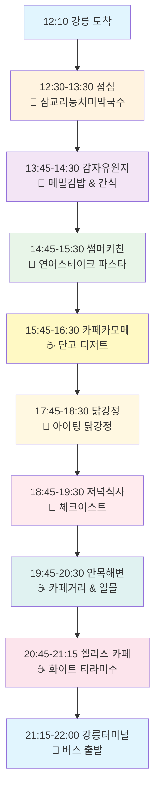
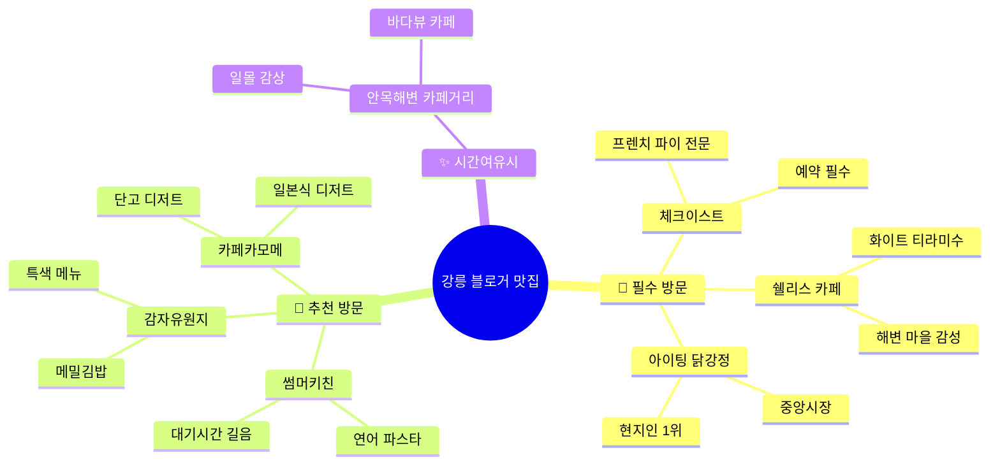

# 강릉 당일치기 여행 코스 (12:10 도착 → 22:00 버스 출발)
> **업데이트**: 블로거 추천 맛집 중심, 오죽헌/경포대 제거, 22:00 강릉터미널 버스 출발

## 🗺️ 여행 일정 플로우차트



## 📍 상세 여행 코스 지도

```mermaid
graph LR
    subgraph "점심 코스 (12:30-13:30)"
        L1[삼교리동치미막국수<br/>⭐4.6 현지인맛집]
    end
    
    subgraph "블로거 추천 간식 (13:45-14:30)"
        C1[감자유원지<br/>🍜 메밀김밥]
    end
    
    subgraph "블로거 추천 런치 (14:45-15:30)"
        D1[썸머키친<br/>🍝 연어파스타]
    end
    
    subgraph "블로거 추천 디저트 (15:45-16:30)"
        E1[카페카모메<br/>☕ 단고 디저트]
    end
    
    subgraph "닭강정 (17:45-18:30)"
        F1[아이팅 닭강정<br/>🍗 현지인 1위 추천]
    end
    
    subgraph "블로거 추천 저녁 (18:45-19:30)"
        G1[체크이스트<br/>🍝 프렌치 파이]
    end
    
    subgraph "카페 투어 (19:45-21:15)"
        H1[안목해변 카페거리<br/>☕ 일몰 카페] --> I1[쉘리스 카페<br/>☕ 블로거 추천 디저트]
    end

    L1 --> C1
    C1 --> D1
    D1 --> E1
    E1 --> F1
    F1 --> G1
    G1 --> H1
    I1 --> TERM[21:15 터미널 이동]
    TERM --> END[22:00 버스 출발]
    
    style L1 fill:#fff3e0
    style C1 fill:#f3e5f5
    style D1 fill:#e8f5e8
    style E1 fill:#fff9c4
    style F1 fill:#fff8e1
    style G1 fill:#ffebee
    style H1 fill:#e0f2f1
    style I1 fill:#fce4ec
    style TERM fill:#fff3e0
    style END fill:#e1f5fe
```



## 🚗 이동 경로 최적화


## ⏰ 시간대별 상세 일정

```mermaid
gantt
    title 강릉 블로거 맛집 투어 스케줄
    dateFormat HH:mm
    axisFormat %H:%M
    
    section 이동
    강릉 도착           :milestone, arrival, 12:10, 0m
    터미널 출발         :milestone, departure, 22:00, 0m
    
    section 식사
    점심 - 삼교리막국수    :lunch, 12:30, 60m
    간식 - 감자유원지      :snack1, 13:45, 45m
    런치 - 썸머키친        :lunch2, 14:45, 45m
    저녁 - 체크이스트      :dinner, 18:45, 45m
    
    section 디저트 & 카페
    카페카모메 디저트      :dessert1, 15:45, 45m
    안목해변 카페거리     :cafe1, 19:45, 45m
    쉘리스 카페          :cafe2, 20:45, 30m
    
    section 간식
    닭강정 맛집          :chicken, 17:45, 45m
    
    section 이동
    강릉터미널 이동       :terminal, 21:15, 45m
```



## 🍽️ 블로거 추천 맛집 우선순위

```mermaid
graph TD
    subgraph "점심 추천 (12:30-13:30)"
        A1[1순위: 삼교리동치미막국수 ⭐4.6 | 🏅현지인맛집  📍 삼교리]
    end
    
    subgraph "블로거 맛집 투어 (13:45-16:30)"
        B1[1순위: 감자유원지 ⭐4.2 | 🏅블로거추천  📍 메밀김밥]
        B2[2순위: 썸머키친 ⭐4.3 | 🏅블로거추천  📍 연어파스타]
        B3[3순위: 카페카모메 ⭐4.1 | 🏅블로거추천  📍 단고디저트]
    end
    
    subgraph "저녁 추천 (17:45-19:30)"
        C1[1순위: 아이팅 닭강정 ⭐4.5 | 🏅현지인1위  📍 중앙시장]
        C2[2순위: 체크이스트 ⭐4.7 | 🏅블로거강추  📍 프렌치파이]
    end
    
    subgraph "카페 추천 (19:45-21:15)"
        D1[필수: 안목해변 카페거리 ⭐4.7 | 🏅바다뷰카페  📍 안목항]
        D2[필수: 쉘리스 카페 ⭐4.5 | 🏅블로거추천  📍 화이트티라미수]
    end

    A1 -.-> B1
    B3 -.-> C1
    C2 -.-> D1
    D1 -.-> D2
    
    style A1 fill:#fff3e0,stroke:#f57f17,stroke-width:3px
    style C1 fill:#fff8e1,stroke:#f57f17,stroke-width:3px
    style C2 fill:#ffebee,stroke:#c62828,stroke-width:3px
    style D1 fill:#e0f2f1,stroke:#2e7d32,stroke-width:3px
    style D2 fill:#fce4ec,stroke:#ad1457,stroke-width:3px
```

## 🎯 방문 우선순위별 맛집



---

## 📋 여행 체크리스트

### 필수 준비물
- [ ] 렌터카 또는 대중교통 패스
- [ ] 현금 (일부 현지맛집 카드 불가)
- [ ] 카메라/스마트폰 (충전기)
- [ ] 편한 신발 (맛집 투어용)

### 블로거 맛집 예약 체크
- [ ] 체크이스트: **예약 필수** (블로거 강조)
- [ ] 썸머키친: 대기시간 길다고 블로거 언급
- [ ] 아이팅 닭강정: 미리 전화 주문 권장

### 운영시간 확인
- [ ] 감자유원지: 운영시간 확인 필요
- [ ] 카페카모메: 운영시간 확인 필요
- [ ] 쉘리스 카페: 운영시간 확인 필요

---

*이 여행 코스는 hwung_travel님 블로그를 참조하여 실제 방문 후기 기반으로 구성된 맛집 중심 코스입니다.*
*2025-01-08 업데이트: 블로거 추천 맛집 중심으로 완전 재구성, 22:00 버스 출발 시간 반영*
*날씨나 개인 취향에 따라 일정을 유연하게 조정하시기 바랍니다.*