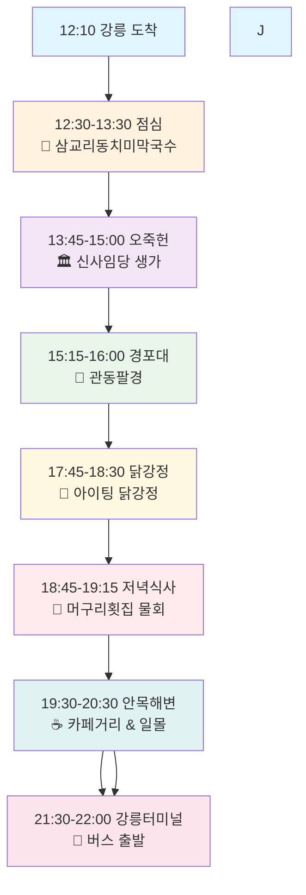
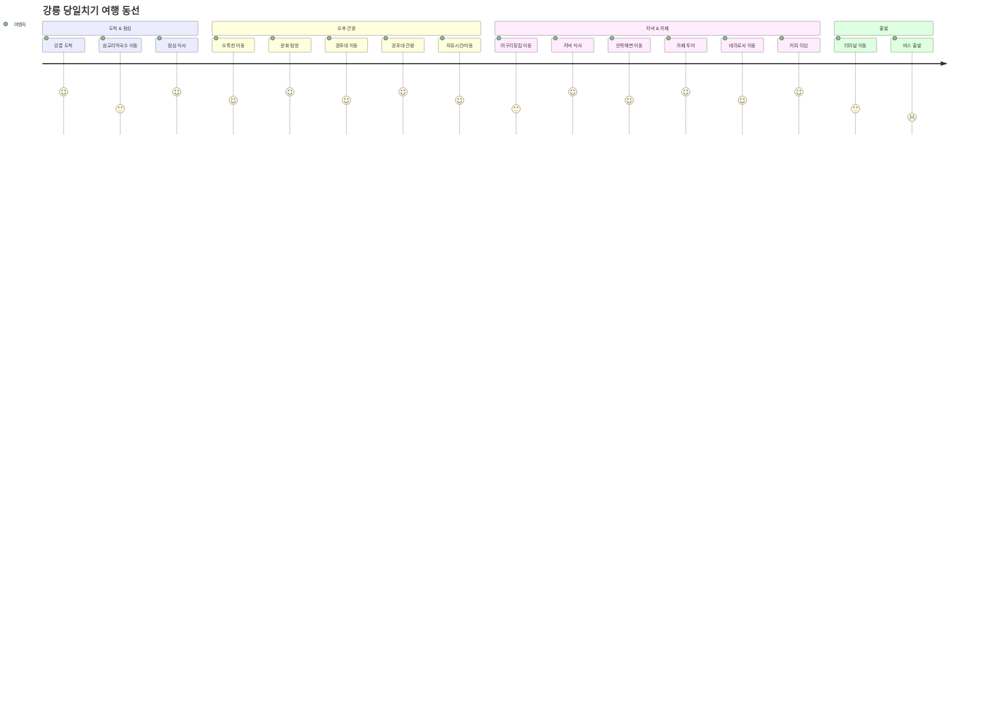
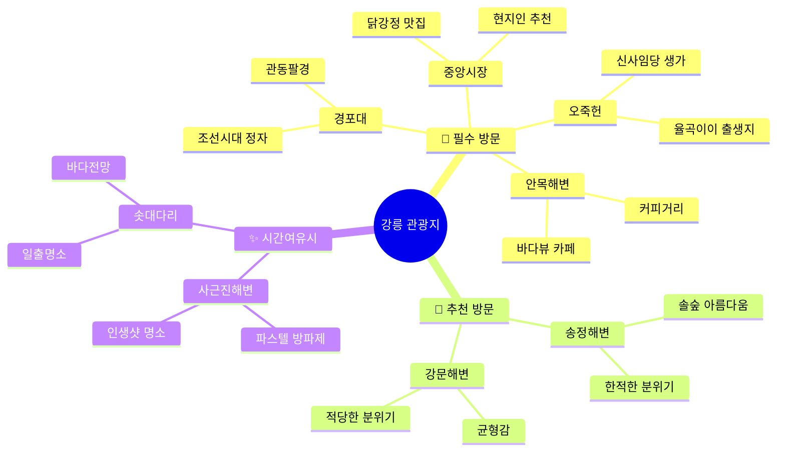

# 강릉 당일치기 여행 코스 (12:10 도착 → 22:00 버스 출발)
> **업데이트**: 안목해변 집중 방문, 22:00 강릉터미널 버스 출발 반영

## 🗺️ 여행 일정 플로우차트



## 📍 상세 여행 코스 지도

```mermaid
graph LR
    subgraph "점심 코스 (12:30-13:30)"
        L1[삼교리동치미막국수<br/>⭐4.6 현지인맛집]
    end
    
    subgraph "문화 탐방 (13:45-15:00)"
        C1[오죽헌<br/>🏛️ 율곡이이 생가]
    end
    
    subgraph "자연 관광 (15:15-16:00)"
        N1[경포대<br/>🌊 관동팔경]
    end
    
    subgraph "닭강정 (17:45-18:30)"
        D1[아이팅 닭강정<br/>🍗 현지인 1위 추천]
    end
    
    subgraph "저녁 코스 (18:45-19:15)"
        D2[머구리횟집<br/>🦑 현지인 추천 물회]
    end
    
    subgraph "카페 투어 (19:30-21:30)"
        CF1[안목해변 카페거리<br/>☕ 일몰 카페] --> CF2[테라로사 본점<br/>☕ 강릉 커피 성지]
    end

    L1 --> C1
    C1 --> N1
    N1 --> D1
    D1 --> D2
    D2 --> CF1
    CF2 --> TERM[21:30 터미널 이동]
    TERM --> END[22:00 버스 출발]
    
    style L1 fill:#fff3e0
    style C1 fill:#f3e5f5
    style N1 fill:#e8f5e8
    style D1 fill:#fff8e1
    style D2 fill:#ffebee
    style CF1 fill:#e0f2f1
    style CF2 fill:#fce4ec
    style TERM fill:#fff3e0
    style END fill:#e1f5fe
```



## 🚗 이동 경로 최적화



## ⏰ 시간대별 상세 일정

```mermaid
gantt
    title 강릉 당일치기 여행 스케줄
    dateFormat HH:mm
    axisFormat %H:%M
    
    section 이동
    강릉 도착           :milestone, arrival, 12:10, 0m
    터미널 출발         :milestone, departure, 22:00, 0m
    
    section 식사
    점심 - 삼교리막국수    :lunch, 12:30, 60m
    저녁 - 머구리횟집      :dinner, 17:45, 75m
    
    section 관광
    오죽헌 문화탐방       :culture, 13:45, 75m
    경포대 관람          :gyeongpo-pavilion, 15:15, 45m
    자유시간/이동         :free-time, 16:15, 90m
    
    section 카페
    안목해변 카페거리     :cafe1, 19:15, 75m
    테라로사 본점        :cafe2, 20:45, 45m
    강릉터미널 이동       :terminal, 21:30, 30m
```



## 🍽️ 맛집 추천 우선순위

```mermaid
graph TD
    subgraph "점심 추천 (12:30-13:30)"
        A1[1순위: 삼교리동치미막국수 ⭐4.6 | 🏅현지인맛집  📍 삼교리]
        A2[2순위: 금학칼국수  ⭐4.4 | 🏅숨은맛집  📍 금학동]
        A3[3순위: 형제칼국수  ⭐4.5 | 🏅로컬단골  📍 시내]
    end
    
    subgraph "저녁 추천 (17:45-19:00)"
        B1[1순위: 머구리횟집  ⭐4.5 | 🏅물회전문  📍 사천면]
        B2[2순위: 동해바다샵1971  ⭐4.6 | 🏅가성비해산물  📍 포남동]
        B3[3순위: 아스따  ⭐4.8 | 🏅현지인90%  📍 강릉역근처]
    end
    
    subgraph "카페 추천 (19:15-21:30)"
        C1[필수: 안목해변 카페거리  ⭐4.7 | 🏅바다뷰카페  📍 안목항]
        C2[필수: 테라로사 본점  ⭐4.7 | 🏅강릉커피성지  📍 구정면]
    end

    A1 -.-> B1
    B1 -.-> C1
    C1 -.-> C2
    
    style A1 fill:#fff3e0,stroke:#f57f17,stroke-width:3px
    style B1 fill:#ffebee,stroke:#c62828,stroke-width:3px
    style C1 fill:#e0f2f1,stroke:#2e7d32,stroke-width:3px
    style C2 fill:#fce4ec,stroke:#ad1457,stroke-width:3px
```

## 🎯 방문 우선순위별 관광지



---

## 📋 여행 체크리스트

### 필수 준비물
- [ ] 렌터카 또는 대중교통 패스
- [ ] 현금 (일부 현지맛집 카드 불가)
- [ ] 카메라/스마트폰 (충전기)
- [ ] 편한 신발 (해변 산책용)
- [ ] 자외선 차단제 (해변 활동)

### 맛집 예약 체크
- [ ] 삼교리동치미막국수: 예약 불필요, 대기 가능성 있음
- [ ] 머구리횟집: 사전 확인 권장
- [ ] 테라로사 본점: 주말 혼잡 가능성

### 관광지 운영시간
- [ ] 오죽헌: 09:00-18:00 (동절기 17:00)
- [ ] 경포대: 24시간 개방
- [ ] 해변: 24시간 개방

---

*이 여행 코스는 현지인 추천 맛집과 필수 관광지를 고려하여 최적화된 동선으로 구성되었습니다.*
*2025-01-08 업데이트: 안목해변 집중 방문, 22:00 버스 출발 시간 반영*
*날씨나 개인 취향에 따라 일정을 유연하게 조정하시기 바랍니다.*