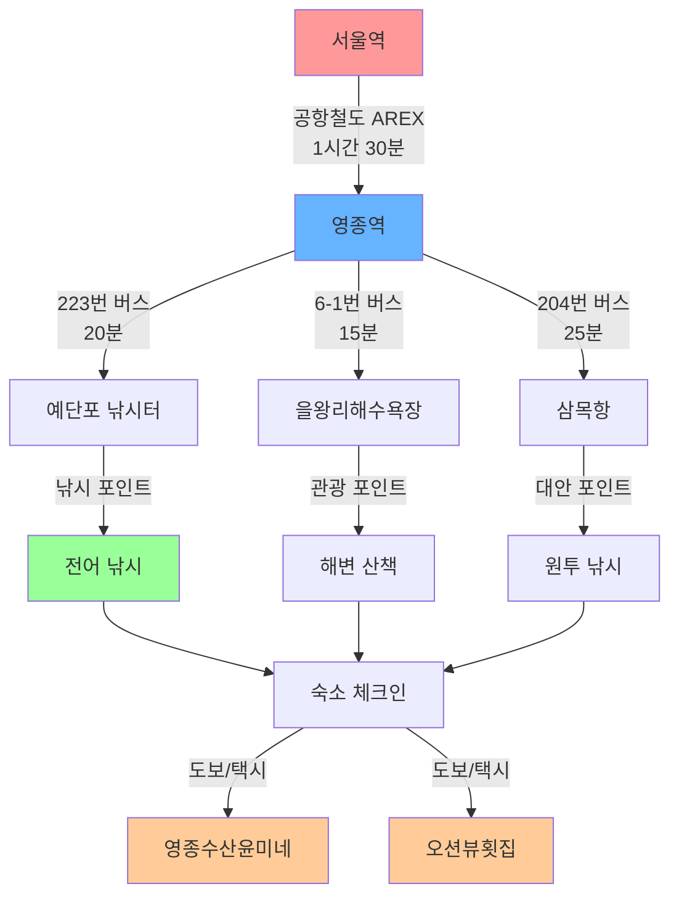
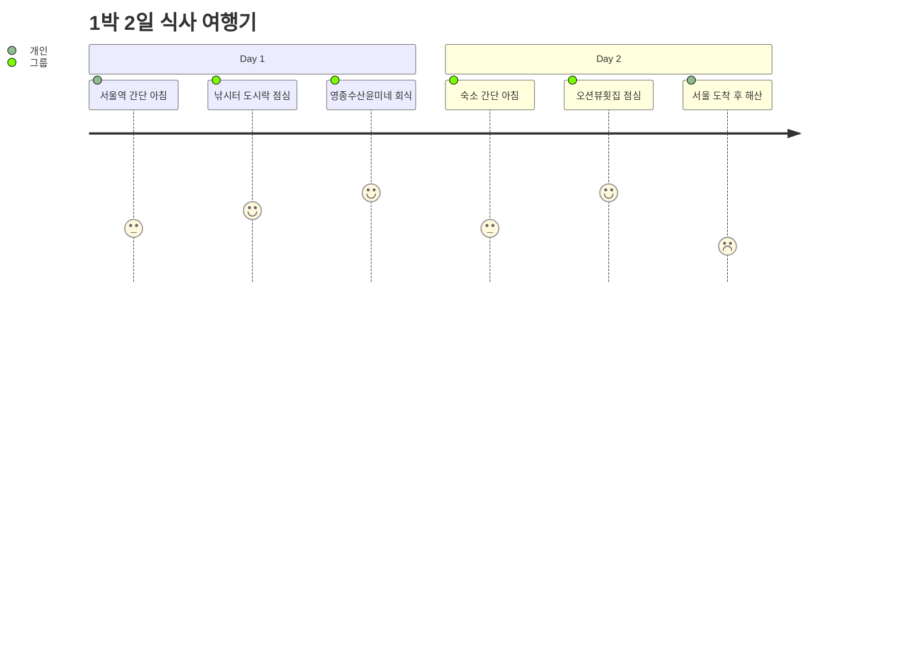
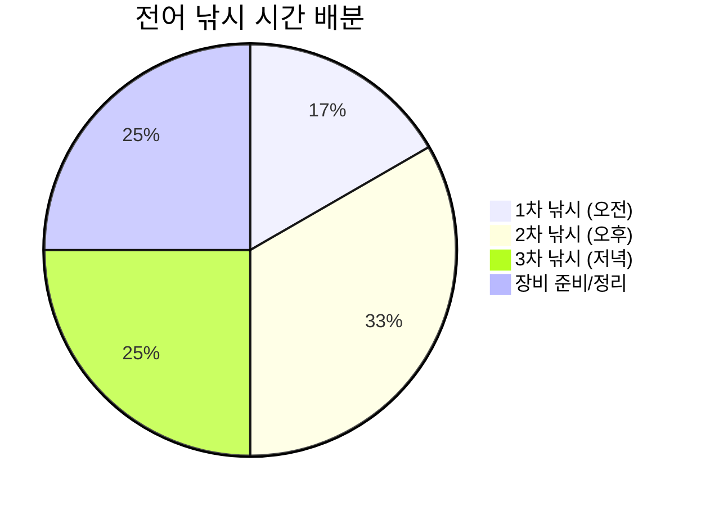
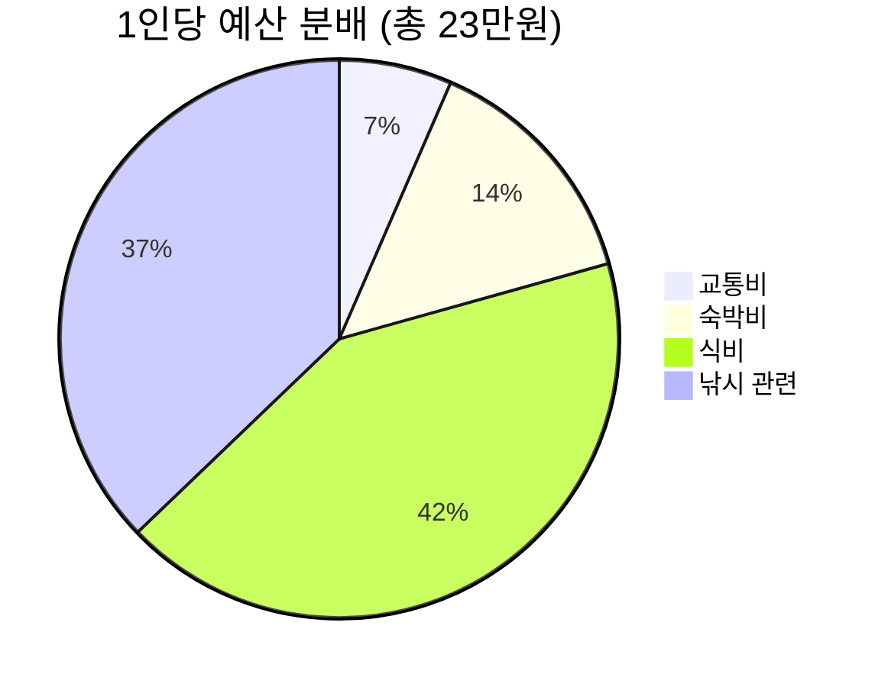
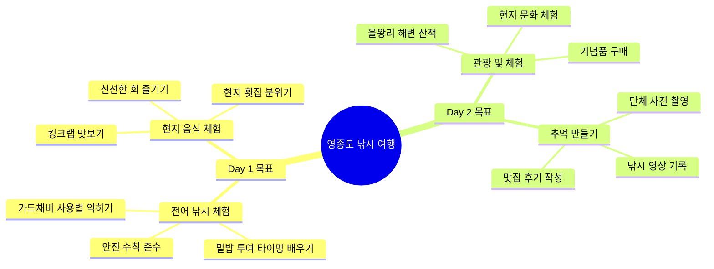
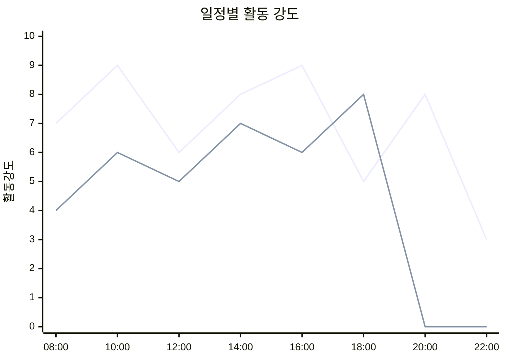

# 🎣 영종도 전어 낚시 1박 2일 일정표

## 📅 전체 일정 다이어그램

```mermaid
gantt
    title 인천 영종도 전어 낚시 1박 2일 여행
    dateFormat  HH:mm
    axisFormat %H:%M
    section Day 1 이동 및 낚시
    서울역 집결 및 출발           :milestone, m1, 08:00, 0m
    공항철도 이동                :08:00, 90m
    영종역 도착 및 버스 연계      :09:30, 30m
    낚시 포인트 도착             :10:00, 30m
    낚시 장비 준비               :10:30, 30m
    전어 낚시 (1차)              :active, fishing1, 11:00, 60m
    점심 식사 휴식               :12:00, 60m
    전어 낚시 (2차)              :active, fishing2, 13:00, 120m
    간식 타임 및 휴식           :15:00, 30m
    전어 낚시 (3차)              :active, fishing3, 15:30, 90m
    낚시 정리 및 장비 반납       :17:00, 60m
    숙소 체크인                  :milestone, m2, 18:00, 0m
    section Day 1 저녁
    숙소 휴식 및 샤워            :18:30, 60m
    영종수산윤미네 회식          :crit, dinner1, 19:30, 120m
    숙소 복귀 및 자유시간        :21:30, 30m
    section Day 2 관광 및 귀가  
    기상 및 아침 식사            :07:00, 60m
    을왕리 해수욕장 산책         :08:00, 60m
    현지 마트 쇼핑               :09:00, 60m
    2차 낚시 또는 관광           :10:00, 90m
    체크아웃 및 짐 정리          :11:30, 30m
    오션뷰횟집 점심              :crit, lunch2, 12:00, 90m
    영종도 관광                  :13:30, 60m
    기념품 구매 및 쇼핑          :14:30, 30m
    영종역 이동                  :15:00, 30m
    서울 출발                    :15:30, 90m
    서울역 도착 및 해산          :milestone, m3, 17:00, 0m
```



## 🎯 핵심 활동 타임라인

```mermaid
timeline
    title 영종도 전어 낚시 여행 하이라이트
    
    section Day 1 - 낚시의 날
        08:00 : 서울역 출발
        10:30 : 영종도 도착
        11:00 : 첫 전어 낚시 시작
        13:00 : 본격 낚시 타임
        17:00 : 낚시 마무리
        19:30 : 현지 횟집 회식
    
    section Day 2 - 관광의 날  
        08:00 : 을왕리 해변 산책
        10:00 : 추가 체험 활동
        12:00 : 바다뷰 점심
        15:00 : 귀가 준비
        17:00 : 서울 도착
```

## 🚌 교통편 연결 다이어그램



## 🍽️ 식사 계획 다이어그램



## 🎣 낚시 세션 계획



## 💰 예산 분배 다이어그램



## 🎯 일일 목표 달성 체크



## ⏰ 시간대별 활동 강도



---

## 📋 일정 체크리스트

### Day 1 체크포인트
- [ ] 08:00 - 서울역 정시 집결 ✅
- [ ] 10:00 - 영종도 안전 도착 ✅  
- [ ] 11:00 - 전어 낚시 시작 ✅
- [ ] 18:00 - 숙소 체크인 완료 ✅
- [ ] 19:30 - 저녁 회식 시작 ✅

### Day 2 체크포인트
- [ ] 08:00 - 을왕리 관광 시작 ✅
- [ ] 12:00 - 점심 식사 완료 ✅
- [ ] 15:00 - 영종역 도착 ✅
- [ ] 17:00 - 서울역 안전 도착 ✅

이 다이어그램을 참고하여 체계적이고 즐거운 영종도 전어 낚시 여행을 즐기시기 바랍니다! 🎣