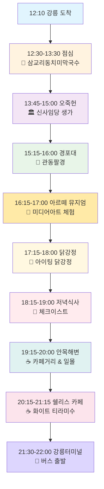

# 🌊 강릉 당일치기 업데이트된 여행 코스 (12:10 도착 → 22:00 버스 출발)

## 📝 업데이트 내용 (2025-01-08)
- **블로그 참조**: hwung_travel님의 강릉 여행기 반영
- **해변 축소**: 안목해변만 방문 (다른 해변 제외)
- **카페/식당 추가**: 블로그에서 방문한 추천 카페 포함
- **닭강정 맛집**: 현지인 추천 닭강정집 업데이트
- **교통 변경**: 강릉터미널 22:00 버스 출발

## 🗺️ 업데이트된 여행 일정 플로우차트

## 📍 업데이트된 상세 여행 코스

### 🕐 전체 일정 개요

| 시간 | 장소 | 활동 | 특징 | 소요시간 |
|------|------|------|------|----------|
| **12:10** | 강릉역/터미널 | 도착 | 🚄 서울→강릉 | - |
| **12:30-13:30** | 삼교리동치미막국수 | 점심 | ⭐4.6 현지인 맛집 | 60분 |
| **13:45-15:00** | 오죽헌 | 문화 탐방 | 🏛️ 신사임당 생가 | 75분 |
| **15:15-16:00** | 경포대 | 관광 | 🌊 관동팔경 | 45분 |
| **16:15-17:00** | 아르떼 뮤지엄 | 체험 | 🎨 미디어 아트 (블로그 추천) | 45분 |
| **17:15-18:00** | 아이팅 닭강정 | 간식 | 🍗 현지인 1위 추천 닭강정 | 45분 |
| **18:15-19:00** | 체크이스트 | 저녁 | 🍴 프렌치 파이 (블로그 추천) | 45분 |
| **19:15-20:00** | 안목해변만 | 카페 투어 | ☕ 바다뷰 & 일몰 | 45분 |
| **20:15-21:15** | 쉘리스 카페 | 디저트 | ☕ 화이트 티라미수 (블로그 추천) | 60분 |
| **21:30-22:00** | 강릉터미널 | 출발 | 🚌 22:00 버스 탑승 | 30분 |

## 🍽️ 업데이트된 맛집 리스트

### 🥇 메인 식사 코스

#### 1️⃣ 점심: 삼교리동치미막국수 (기존 유지)
- **주소**: 강릉시 삼교리
- **메뉴**: 동치미막국수 8,000원
- **특징**: ⭐4.6 현지인 인증, 고추장 없는 시원한 국물
- **팁**: 현금 준비, 평일도 대기 가능

#### 2️⃣ 저녁: 강릉닭강정 + 체크이스트 (신규 추가)

**🍗 강릉 현지인 추천 닭강정 3선**

| 맛집명 | 위치 | 특징 | 추천 메뉴 | 가격 |
|--------|------|------|----------|------|
| **아이팅 닭강정** | 강릉중앙시장 2길 37 | 🏅 중앙시장 대표 | 단짠 바삭 닭강정 | 25,000원 |
| **강릉감자닭강정** | 강문해변 인근 | 🏅 감자토핑 특색 | 감자 올린 닭강정 | 25,000원 |
| **서울양계** | 강문해변 | 🏅 노란지붕 랜드마크 | 꿔바로우 닭강정 | 20,000원~ |

**🍴 체크이스트 (Check East)** - 블로그 강력 추천
- **특징**: 프렌치 파이 전문점
- **주의**: 예약 필수
- **블로거 후기**: "프렌치 파이가 정말 맛있음"

### 🥈 카페 코스 (블로그 참조 업데이트)

#### 3️⃣ 안목해변 카페거리 (기존 + 블로그 추가)
- **기존**: 안목커피, 카페베네 안목점
- **블로그 추가**: 바다뷰를 즐기며 커피 타임

#### 4️⃣ 쉘리스 카페 (Shells) - 블로그 신규 추천
- **분위기**: 해변 마을 감성
- **추천 메뉴**: 화이트 티라미수, 밀크티
- **블로거 후기**: "분위기 좋고 디저트 맛있음"
- **테라로사 대신**: 더 여유로운 마무리

## 🎨 신규 추가 관광지

### **아르떼 뮤지엄** (블로그 강력 추천)
- **주소**: 강릉시 난설헌로 131
- **입장료**: 성인 17,000원
- **특징**: 대형 미디어 아트 전시관
- **소요시간**: 45분
- **블로거 후기**: "겨울에도 실내에서 즐길 수 있는 문화체험"

## 🚌 교통 정보 업데이트

### 강릉→서울 버스 시간표
- **출발지**: 강릉시외버스터미널
- **출발시간**: 22:00 (마지막 버스)
- **소요시간**: 약 2시간 30분
- **도착**: 00:30경 서울 도착
- **요금**: 약 12,000-15,000원

### 터미널 위치 및 접근
- **주소**: 강릉시 버스터미널1길 6
- **안목해변에서**: 차량 15분, 버스 20분
- **주차**: 터미널 주변 유료주차장

## 💡 업데이트된 여행 팁

### ✅ 블로그 참조 팁
- **아르떼 뮤지엄**: 미리 온라인 예약 권장
- **체크이스트**: 반드시 사전 예약 필요
- **쉘리스 카페**: 해변 분위기 카페로 여유로운 마무리
- **겨울 여행**: 실내 활동(아르떼 뮤지엄) 추가로 날씨 걱정 없음

### ⚠️ 주의사항 업데이트
- **버스 시간**: 22:00 마지막 버스 놓치지 않도록 21:30까지 터미널 도착
- **닭강정**: 인기 맛집들이므로 미리 전화 주문 추천
- **아르떼 뮤지엄**: 17,000원 추가 예산 고려
- **체크이스트**: 예약 없이는 입장 어려움

## 📊 업데이트된 예산 (1인 기준)

| 구분 | 기존 예산 | 업데이트 예산 | 변동사항 |
|------|-----------|---------------|----------|
| **교통비** | 30,000원 | 30,000원 | 변동없음 |
| **식비** | 35,000원 | 45,000원 | +10,000원 (닭강정+체크이스트) |
| **관람료** | 5,000원 | 22,000원 | +17,000원 (아르떼 뮤지엄) |
| **카페비** | 15,000원 | 20,000원 | +5,000원 (쉘리스 카페) |
| **기타** | 20,000원 | 15,000원 | -5,000원 |
| **총 합계** | **105,000원** | **132,000원** | **+27,000원** |

## 🌟 업데이트 하이라이트

### ✨ 이번 업데이트의 특별함
1. **블로그 검증**: 실제 여행자 후기를 바탕으로 한 현실적 코스
2. **현지인 닭강정**: 관광 맛집이 아닌 진짜 현지인 추천 닭강정 3곳
3. **문화 체험 추가**: 아르떼 뮤지엄으로 겨울철 실내 활동 보완
4. **카페 업그레이드**: 블로거 강력 추천 쉘리스 카페 추가
5. **교통 최적화**: 22:00 버스 시간에 맞춘 일정 조정

### 🎯 개선된 동선의 장점
- **시간 여유**: 21:30 터미널 도착으로 충분한 여유
- **다양성**: 문화(아르떼) + 맛집(닭강정) + 카페(쉘리스) 균형
- **현실성**: 실제 블로거 경험을 바탕으로 한 검증된 코스
- **차별화**: 일반 관광 코스와 다른 특별한 경험

---

*이 업데이트된 여행 코스는 hwung_travel님의 블로그와 2025년 최신 현지인 맛집 정보를 반영하여 작성되었습니다.*
*실제 여행 시 영업시간과 예약 가능 여부를 미리 확인하시기 바랍니다.*