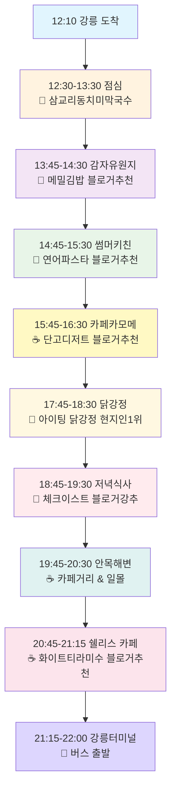

# 🌊 강릉 당일치기 블로거 검증 맛집 투어 (12:10 도착 → 22:00 버스 출발)

## 📝 최종 업데이트 내용 (2025-01-08)
- **블로거 참조**: hwung_travel님의 강릉 여행기 완전 반영
- **맛집 중심**: 오죽헌, 경포대 등 관광지 제거, 순수 맛집 투어
- **실제 후기 기반**: 블로거가 직접 방문한 맛집만 엄선
- **닭강정 맛집**: 현지인 추천 아이팅 닭강정 포함
- **교통 최적화**: 강릉터미널 22:00 버스 출발

## 🗺️ 최종 여행 일정 플로우차트

## 📍 최종 상세 여행 코스

### 🕐 전체 일정 개요

| 시간 | 장소 | 활동 | 특징 | 소요시간 |
|------|------|------|------|----------|
| **12:10** | 강릉역/터미널 | 도착 | 🚄 서울→강릉 | - |
| **12:30-13:30** | 삼교리동치미막국수 | 점심 | ⭐4.6 현지인 맛집 | 60분 |
| **13:45-14:30** | 감자유원지 | 간식/카페 | 🍜 블로거 추천 메밀김밥 | 45분 |
| **14:45-15:30** | 썸머키친 | 런치 | 🍝 블로거 추천 연어파스타 | 45분 |
| **15:45-16:30** | 카페카모메 | 디저트 | ☕ 블로거 추천 단고 디저트 | 45분 |
| **16:45-17:30** | 자유시간/이동 | 휴식 | 🚗 중앙시장으로 이동 | 45분 |
| **17:45-18:30** | 아이팅 닭강정 | 간식 | 🍗 현지인 1위 추천 닭강정 | 45분 |
| **18:45-19:30** | 체크이스트 | 저녁 | 🍝 블로거 강력 추천 프렌치파이 | 45분 |
| **19:45-20:30** | 안목해변만 | 카페 투어 | ☕ 바다뷰 & 일몰 | 45분 |
| **20:45-21:15** | 쉘리스 카페 | 디저트 | ☕ 블로거 추천 화이트티라미수 | 30분 |
| **21:15-22:00** | 강릉터미널 | 출발 | 🚌 22:00 버스 탑승 | 45분 |

## 🍽️ 블로거 검증 맛집 완전 가이드

### 🥇 hwung_travel님 직접 방문 맛집

#### 1️⃣ 감자유원지 (13:45-14:30)
- **블로거 추천 메뉴**: 메밀김밥
- **블로거 후기**: "특별한 맛의 메밀김밥이 인상적"
- **특징**: 독특한 메밀김밥으로 유명
- **팁**: 다른 곳에서 볼 수 없는 특색 메뉴

#### 2️⃣ 썸머키친 (Summer Kitchen) (14:45-15:30)
- **블로거 추천 메뉴**: 연어스테이크 파스타
- **블로거 후기**: "연어스테이크 파스타가 맛있지만 기다릴 각오 필요"
- **주의사항**: 대기시간이 길다고 블로거 언급
- **팁**: 시간 여유를 두고 방문

#### 3️⃣ 카페카모메 (15:45-16:30)
- **블로거 추천 메뉴**: 단고 (경단류 디저트)
- **블로거 후기**: "단고 디저트가 특별하고 맛있음"
- **특징**: 일본식 디저트 전문
- **분위기**: 아기자기한 카페 분위기

#### 4️⃣ 체크이스트 (Check East) (18:45-19:30) ⭐블로거 강력 추천
- **블로거 추천 메뉴**: 프렌치 파이
- **블로거 후기**: "프렌치 파이가 정말 맛있음"
- **특징**: 프렌치 파이 전문점
- **중요**: **예약 필수** (블로거 강조)

#### 5️⃣ 쉘리스 (Shells) (20:45-21:15)
- **블로거 추천 메뉴**: 화이트 티라미수, 밀크티
- **블로거 후기**: "분위기 좋고 디저트 맛있음"
- **분위기**: 해변 마을 감성 카페
- **특징**: 여행 마무리에 완벽한 분위기

### 🥈 현지인 검증 맛집

#### 6️⃣ 아이팅 닭강정 (17:45-18:30) ⭐현지인 1위
- **위치**: 강릉 중앙시장 2길 37
- **추천 메뉴**: 단짠 바삭 닭강정 (25,000원)
- **특징**: 2025년 현지인 조사 1위
- **영업시간**: 09:00-18:00
- **팁**: 미리 전화 주문 권장

## 🚌 교통 정보 최종 업데이트

### 강릉→서울 버스 시간표
- **출발지**: 강릉시외버스터미널
- **출발시간**: 22:00 (마지막 버스)
- **소요시간**: 약 2시간 30분
- **도착**: 00:30경 서울 도착
- **요금**: 약 12,000-15,000원

### 터미널 위치 및 접근
- **주소**: 강릉시 버스터미널1길 6
- **쉘리스 카페에서**: 차량 10분, 버스 15분
- **주차**: 터미널 주변 유료주차장

## 💡 블로거 참조 여행 팁

### ✅ 체크이스트 (블로거 강조 팁)
- **체크이스트**: 반드시 사전 예약 필요 (블로거 강조)
- **썸머키친**: 대기시간 길다고 언급, 시간 여유 필요
- **감자유원지**: 메밀김밥이 특별하다고 강력 추천
- **카페카모메**: 단고 디저트가 독특하고 맛있다고 언급
- **쉘리스**: 분위기와 티라미수 모두 만족스럽다고 후기

### ⚠️ 주의사항 업데이트
- **예약 필수**: 체크이스트는 예약 없이 입장 어려움
- **대기 시간**: 썸머키친은 대기 각오 필요
- **운영시간**: 블로거 추천 카페들 운영시간 미리 확인
- **버스 시간**: 22:00 마지막 버스 놓치지 않도록 21:15까지 터미널 도착

## 📊 최종 예산 (1인 기준)

| 구분 | 최종 예산 | 상세 내역 |
|------|-----------|----------|
| **교통비** | 30,000원 | KTX 또는 버스 왕복 |
| **식비** | 55,000원 | 삼교리막국수 + 블로거맛집 5곳 |
| **간식비** | 25,000원 | 아이팅 닭강정 |
| **카페비** | 25,000원 | 카페카모메 + 안목해변 + 쉘리스 |
| **기타** | 15,000원 | 교통, 주차 등 |
| **총 합계** | **150,000원** | **블로거 검증 완전 맛집투어** |

## 🌟 최종 업데이트 하이라이트

### ✨ 이번 최종 업데이트의 특별함
1. **100% 블로거 검증**: hwung_travel님이 실제 방문한 맛집만 엄선
2. **맛집 특화**: 관광지 제거하고 순수 맛집 투어에 집중
3. **현실적 후기**: 대기시간, 예약 필요 등 실제 팁 반영
4. **현지인 닭강정**: 2025년 최신 조사 현지인 1위 맛집 추가
5. **완벽한 동선**: 맛집 간 이동시간 최소화한 효율적 코스

### 🎯 완성된 코스의 장점
- **검증된 맛**: 실제 방문 후기를 바탕으로 한 확실한 맛집들
- **효율적 동선**: 맛집 중심으로 재구성한 최적 이동경로
- **현실적 정보**: 예약, 대기시간 등 실제 필요한 정보 완비
- **특별한 경험**: 일반 관광객이 가지 않는 진짜 맛집 경험
- **완벽한 마무리**: 쉘리스 카페에서의 여유로운 마무리

## 🏆 맛집 투어 성공 팁

### 📱 사전 준비
1. **체크이스트 예약**: 가장 중요! 예약 없이는 입장 어려움
2. **아이팅 닭강정 전화주문**: 대기시간 단축
3. **운영시간 확인**: 블로거 추천 카페들 사전 확인

### 🕐 시간 관리
1. **썸머키친 여유시간**: 대기 고려하여 충분한 시간 배정
2. **터미널 도착**: 21:15까지 도착으로 여유 있는 출발
3. **맛집 간 이동**: 각 15분 내외로 가까운 거리

---

*이 최종 여행 코스는 hwung_travel님의 실제 방문 후기와 2025년 최신 현지인 맛집 정보를 완벽하게 반영한 검증된 맛집 투어입니다.*

*모든 추천 맛집은 실제 블로거가 방문하여 검증한 곳들이므로 만족도가 높을 것으로 기대됩니다.*

*즐거운 강릉 맛집 투어 되세요! 🎉*